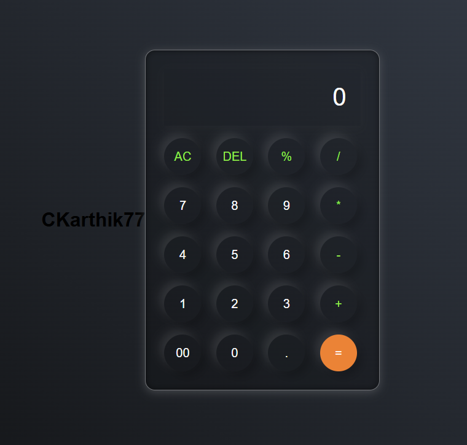

<div align="center">

# 🧮 Modern Calculator Web App

<p align="center">
  
</p>
*A sleek, responsive calculator with dark theme and smooth animations*

[](https://your-deployed-app.link)
[](https://github.com/CKarthik77/calculator)
[](LICENSE)

---

## ✨ Features

<table align="center">
  <tr>
    <td align="center">➕ Basic Operations</td>
    <td align="center">🎨 Dark Theme</td>
    <td align="center">📱 Responsive</td>
  </tr>
  <tr>
    <td align="center">🔄 Memory Controls</td>
    <td align="center">✨ Animations</td>
    <td align="center">⌨️ Keyboard Support</td>
  </tr>
</table>

## 🛠️ Built With

<p align="center">
  
  
  
</p>

## 🚀 Quick Start

```bash
git clone https://github.com/CKarthik77/calculator.git
cd calculator
start index.html
```

## 📱 Responsive Design

<table align="center">
  <tr>
    <td align="center">📱 Mobile</td>
    <td align="center">💻 Tablet</td>
    <td align="center">🖥️ Desktop</td>
  </tr>
  <tr>
    <td align="center"></td>
    <td align="center"></td>
    <td align="center"></td>
  </tr>
</table>

## 🤝 Contributing

<p align="center">
  <a href="CONTRIBUTING.md">Contributing Guidelines</a> •
  <a href="CODE_OF_CONDUCT.md">Code of Conduct</a> •
  <a href="../../issues">Submit an Issue</a>
</p>

## 👨‍💻 Author

<p align="center">
  <a href="https://github.com/CKarthik77">
    
    <br/>
    <sub><b>Karthik C</b></sub>
  </a>
</p>

## 📬 Contact

<p align="center">
  <a href="mailto:your.email@example.com">
    
  </a>
  <a href="https://github.com/CKarthik77">
    
  </a>
</p>

---

<sub>Built with ❤️ and JavaScript</sub>  
<sub>Star ⭐ this repo if you found it helpful!</sub>

</div>